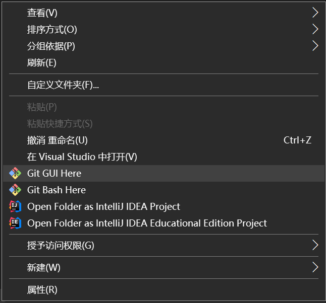
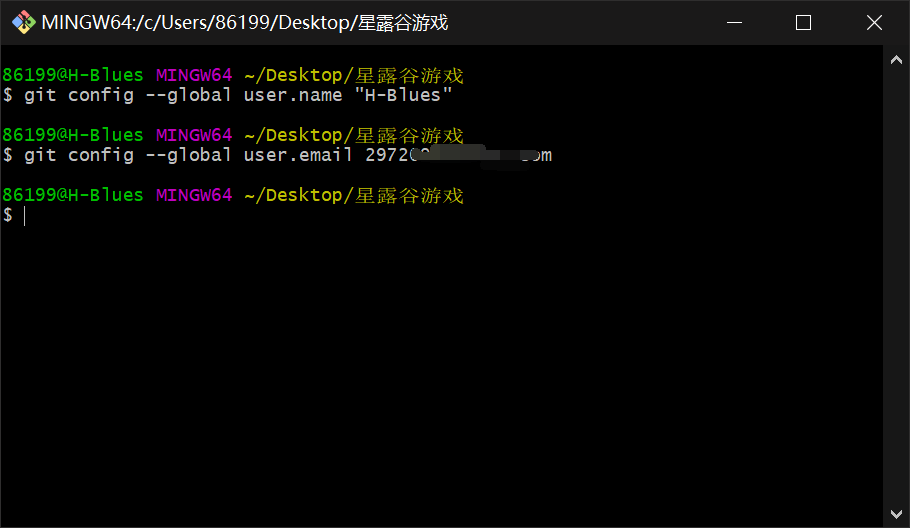

# git使用教程

详细学习可以查看以下网站

- [易百教程 https://www.yiibai.com/git](https://www.yiibai.com/git)

## 1. 配置和初始化

1. 桌面新建项目文件夹

2. 进入文件夹，鼠标右击 `git bash here`

   

3. 设置用户名和邮箱地址(推荐和github的一致)

   ```bash
   $ git config --global user.name "引号里填自己的用户名"
   $ git config --global user.email 你的邮箱地址
   ```

   

4. 初始化仓库

   ```bash
   $ git init
   ```

## 2. 克隆远程仓库

将github上的代码先拷贝到本地

```bash
$ git clone https://github.com/H-Blues/stardew-valley-game.git
```

## 3. 一些基本操作

### 3.1 上传到github

**注意：代码的每一次提交上传都与某一特定功能对应**

如：某几个文件实现了人物移动的功能，则将这几个文件提交

1.  将本地写的代码添加到git

   ```bash
   $ git add 某一个文件或文件夹的路径
   ```

2.  提交commit，并写commit message

   ```bash
   $ git commit -m '这里填写commit message'
   ```

   **commit message的书写规范：固定词+描述**

   固定词根据以下情况选择

   - Config: 添加一些配置信息
   - Add: 添加新的功能
   - Remove: 移动文件
   - Update: 更新某文件的内容

3.  上传到github远端仓库

   ```bash
   $ git push origin master
   ```

### 3.2 与远程仓库同步

可以理解成更新代码

```bash
$ git pull origin next
```

